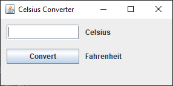
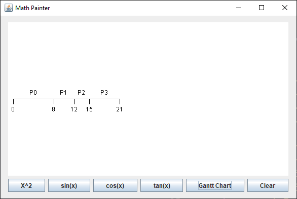

# Java GUI
 A step by step examples about designing GUI using Java swing and awt.

## Contents

### [Lesson 1](src/lesson01)
Introduction to Swing Components such as JButton, JTextField, and JLabel.

### [Lesson 2](src/lesson02)
In this lesson, we implement naive text editor. You will learn how to use JFileChooser to display open and save dialog. Moreover, a textarea used to display file contents (JTextArea).

### [Lesson 3](src/lesson03)
Display formated numbers in textfield.

### [Lesson 4](src/lesson04)
Using JList add/edit/remove item.

### [Lesson 5](src/lesson05)
Introduction to menu.

### [Lesson 6](src/lesson06)
Display data using JTable.

### [Lesson 7](src/lesson07)
Introduction to draw in Java.

